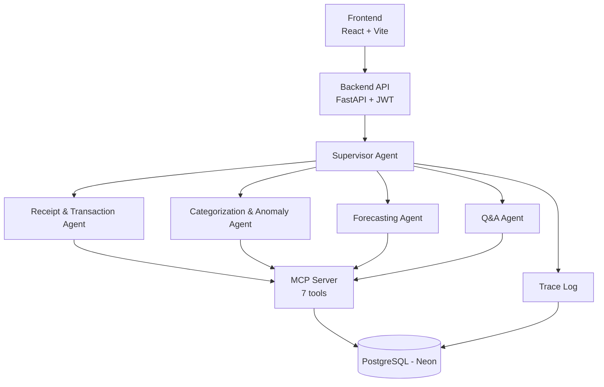

# FinSight AI

AI-powered personal finance assistant built for Arbisoft's 2026 AI Internship, Phase 3. Five specialized agents — Receipt & Transaction, Categorization & Anomaly, Forecasting, Q&A, and a Supervisor coordinating them — handle expense tracking, spending insights, and forecasting through a single conversational interface.

## Architecture



Anomaly detection isn't a separate agent — it lives inside the Categorization Agent, which flags a transaction when it's more than 2.5x the user's average weekly spend in that category (falling back to a same-category-transaction average when there isn't a distinct prior week yet). The Forecasting Agent compares projected month-end spend against a real budget when one is set, or the user's historical monthly average for that category otherwise. Every agent invocation is recorded to a `Trace` table (visible via `GET /traces`) independently of the MCP server's own data tools.

## Tech Stack

| Layer | Technology |
|---|---|
| Frontend | React + Vite + TypeScript + Tailwind CSS |
| Backend | FastAPI + SQLAlchemy (async) + PostgreSQL |
| Auth | JWT (bcrypt + SHA-256 pre-hash) |
| Agents | Anthropic API + Groq API, custom ReAct loop implemented against both providers' native tool-calling formats |
| Receipt Parsing | Anthropic vision API |
| Migrations | Alembic |
| Testing | pytest + pytest-asyncio + pytest-cov |

## Model Selection

- **`claude-haiku-4-5`** for the Supervisor's own intent/complexity classification and Forecasting's summary phrasing — frequent, low-complexity calls where Haiku's cost and latency matter more than extra reasoning depth.
- **`openai/gpt-oss-120b` via Groq** for requests the Supervisor classifies as "simple" — all categorization requests, plus straightforward single-fact Q&A questions. Groq's inference speed makes this the fast path, and this model is capable enough for a single lookup-and-answer. (Previously Llama 3.3 70B, until Groq decommissioned it on 2026-08-16.)
- **`claude-sonnet-5`** for requests the Supervisor classifies as "complex" — multi-part questions or anything requiring reasoning across several pieces of data, where the extra depth is worth the added latency. Also used (alongside Haiku) in the Chat page's manual "Compare Models" mode, and always used for receipt/statement parsing regardless of complexity, since that's a vision requirement unrelated to the complexity routing.
- **Anthropic vision API** for receipt parsing — extracting merchant, amount, and date from a receipt image is a multimodal task a text-only model can't do; vision input lets the Receipt Agent skip a separate OCR step entirely.

## Setup

### Option A: Docker (fully containerized)

Backend and frontend both run in containers; the database is still the real, externally-hosted Neon instance (there's no local Postgres container - Neon already provides that).

```bash
git clone <repo-url>
cd finsight-ai

cp .env.example .env
# edit .env and fill in DATABASE_URL, SECRET_KEY, ANTHROPIC_API_KEY, GROQ_API_KEY

docker compose up --build
```

That's it - the backend applies any pending Alembic migrations on startup, then serves on `http://localhost:8000`; the frontend builds and serves on `http://localhost:5173`. Both ports, and the CORS origin the backend accepts, are configurable via `.env` (see the commented-out `CORS_ORIGINS`/`VITE_API_BASE_URL` lines in `.env.example`) if you need to change them from the defaults.

### Option B: Manual (run each side locally)

```bash
git clone <repo-url>
cd finsight-ai/backend

# create backend/.env
echo "DATABASE_URL=postgresql://<user>:<pass>@<host>/<db>?sslmode=require" >> .env
echo "SECRET_KEY=$(python -c 'import secrets; print(secrets.token_hex(32))')" >> .env
echo "ANTHROPIC_API_KEY=<your Anthropic API key>" >> .env
echo "GROQ_API_KEY=<your Groq API key>" >> .env

pip install -r requirements.txt
alembic upgrade head
uvicorn app.main:app --reload
```

```bash
cd finsight-ai/frontend
npm install
npm run dev
```

The frontend expects the backend at `http://localhost:8000` by default (override with a `VITE_API_BASE_URL` env var); the backend allows CORS from `http://localhost:5173` (override with a `CORS_ORIGINS` env var, comma-separated).

## Status

**Built — backend and frontend are both complete and functional:**
- Backend (FastAPI + async SQLAlchemy), 6 data models: User, Category, Transaction, Budget, Anomaly, Trace
- Alembic migrations applied (initial schema, `Trace` table, `date_estimated` on `Transaction`)
- JWT auth: access + refresh tokens (`get_current_user` dependency, owner-scoped, refresh flow with token-type checking)
- MCP server with 7 tools backing the agents (`get_transactions`, `record_transaction`, `get_budget`, `get_monthly_summary`, `get_historical_monthly_average`, `get_weekly_average`, `get_anomalies`)
- Supervisor + 4 worker agents, all live and wired end-to-end: Receipt & Transaction (vision-based extraction, handles both single receipts and multi-transaction statements), Categorization & Anomaly (weekly-average baseline, 2.5x threshold), Forecasting (budget baseline, falling back to historical monthly average when no budget is set), Q&A (routed through the Supervisor's classifier)
- Multi-model routing: the Supervisor classifies each categorize/Q&A request as "simple" or "complex" in the same call that determines intent, then routes simple requests to `openai/gpt-oss-120b` via Groq and complex Q&A to `claude-sonnet-5`; every trace entry records which model actually handled that step. The Chat page also has a manual "Compare Models" toggle (Haiku vs Sonnet side by side, independent of the automatic routing)
- Every agent invocation logged to the `Trace` table (`GET /traces`)
- Budget management: set/update/remove per category, upsert (not duplicate) on repeat submission
- Transaction CRUD: create, list (with category name + estimated-date flag), delete
- Frontend (React + Vite + TypeScript + Tailwind): login/signup, Dashboard (transactions + receipt/statement upload merged into one view, delete), Forecast (projections, budget management inline), Chat (Q&A) — loading, error, and empty states implemented throughout
- Test suite: 106 tests (pytest + pytest-asyncio, transactional-rollback isolation against the real Neon schema), 70% overall coverage, with every priority area — auth, models, forecasting math, categorization anomaly logic, route-level auth protection, budget upsert — above 70%, several at 100%
- Output validation: every LLM call point that expects structured output (categorization's category prediction, Q&A's final-answer JSON on both the Anthropic and Groq paths) retries once on a malformed response before falling back gracefully; Forecasting's summary call falls back to a deterministic generic summary if the API call itself fails, rather than the whole forecast erroring out
- Deployment: fully containerized locally via Docker (`backend/Dockerfile`, `frontend/Dockerfile`, root `docker-compose.yml`) - see Setup below

**Next:**
- Memory layer (agents are currently stateless aside from the `Trace` log)
- Hosted deployment (the Docker setup runs locally; nothing's deployed to a public host yet)
- Presentation materials (slides, demo video, reflection doc)
