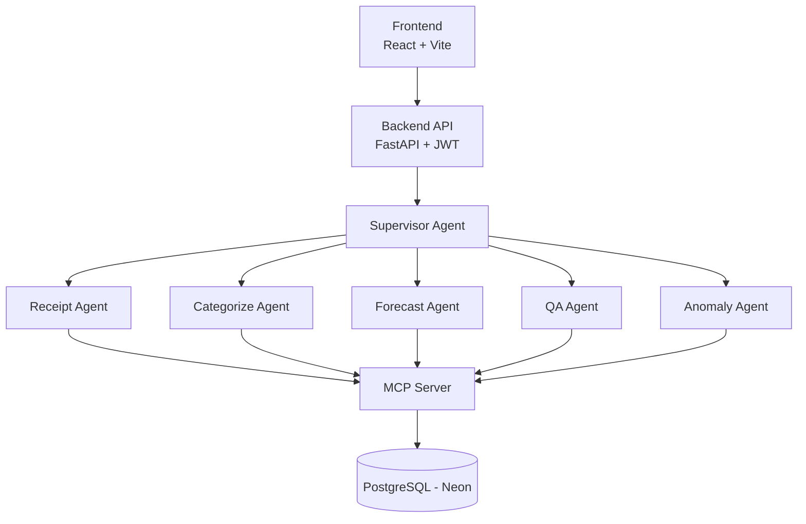

# FinSight AI

AI-powered personal finance assistant built for Arbisoft's 2026 AI Internship, Phase 3. Five specialized agents — Receipt & Transaction, Categorization & Anomaly, Forecasting, Q&A, and a Supervisor coordinating them — handle expense tracking, spending insights, and forecasting through a single conversational interface.

## Architecture



## Tech Stack

| Layer | Technology |
|---|---|
| Frontend | React + Vite |
| Backend | FastAPI + SQLAlchemy (async) + PostgreSQL |
| Auth | JWT (bcrypt + SHA-256 pre-hash) |
| Agents | Anthropic API, `claude-haiku-4-5`, custom ReAct loop |
| Receipt Parsing | Anthropic vision API |
| Migrations | Alembic |

## Model Selection

- **`claude-haiku-4-5`** for routine agent tasks (categorization, anomaly checks, forecasting, Q&A routing) — these are frequent, low-complexity calls where Haiku's lower cost and latency matter far more than the extra reasoning depth a larger model would add.
- **Anthropic vision API** for receipt parsing — extracting merchant, amount, and date from a receipt image is a multimodal task a text-only model can't do; vision input lets the Receipt Agent skip a separate OCR step entirely.

## Setup

```bash
git clone <repo-url>
cd finsight-ai/backend

# create backend/.env
echo "DATABASE_URL=postgresql://<user>:<pass>@<host>/<db>?sslmode=require" >> .env
echo "SECRET_KEY=$(python -c 'import secrets; print(secrets.token_hex(32))')" >> .env

pip install -r requirements.txt
alembic upgrade head
uvicorn app.main:app --reload
```

```bash
cd finsight-ai/frontend
npm install
npm run dev
```

The frontend expects the backend at `http://localhost:8000` by default (override with a `VITE_API_BASE_URL` env var); the backend allows CORS from `http://localhost:5173`.

## Status

**Built:**
- Backend scaffold (FastAPI + async SQLAlchemy)
- 5 data models: User, Category, Transaction, Budget, Anomaly
- Alembic migrations configured
- JWT auth (`get_current_user` dependency, owner-scoped)
- 5 routes wired to real agents: transactions, receipts, categorize, forecast, qa
- Frontend (React + Vite + TypeScript + Tailwind): login/signup, dashboard, chat

**Next:**
- Memory layer
- Test suite
- Deployment
