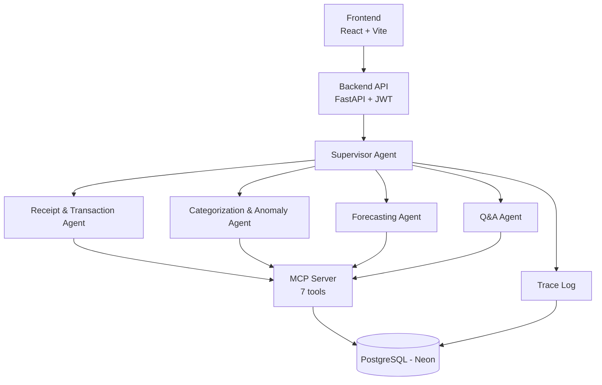

# FinSight AI

AI-powered personal finance assistant built for Arbisoft's 2026 AI Internship, Phase 3. Five specialized agents — Receipt & Transaction, Categorization & Anomaly, Forecasting, Q&A, and a Supervisor coordinating them — handle expense tracking, spending insights, and forecasting through a single conversational interface.

## Architecture



Anomaly detection isn't a separate agent — it lives inside the Categorization Agent, which flags a transaction when it's more than 2.5x the user's average weekly spend in that category (falling back to a same-category-transaction average when there isn't a distinct prior week yet). The Forecasting Agent compares projected month-end spend against a real budget when one is set, or the user's historical monthly average for that category otherwise. Every agent invocation is recorded to a `Trace` table (visible via `GET /traces`) independently of the MCP server's own data tools.

## Tech Stack

| Layer | Technology |
|---|---|
| Frontend | React + Vite + TypeScript + Tailwind CSS |
| Backend | FastAPI + SQLAlchemy (async) + PostgreSQL |
| Auth | JWT (bcrypt + SHA-256 pre-hash) |
| Agents | Anthropic API, `claude-haiku-4-5`, custom ReAct loop |
| Receipt Parsing | Anthropic vision API |
| Migrations | Alembic |
| Testing | pytest + pytest-asyncio + pytest-cov |

## Model Selection

- **`claude-haiku-4-5`** for routine agent tasks (categorization, anomaly checks, forecasting, Q&A routing) — these are frequent, low-complexity calls where Haiku's lower cost and latency matter far more than the extra reasoning depth a larger model would add.
- **Anthropic vision API** for receipt parsing — extracting merchant, amount, and date from a receipt image is a multimodal task a text-only model can't do; vision input lets the Receipt Agent skip a separate OCR step entirely.

## Setup

```bash
git clone <repo-url>
cd finsight-ai/backend

# create backend/.env
echo "DATABASE_URL=postgresql://<user>:<pass>@<host>/<db>?sslmode=require" >> .env
echo "SECRET_KEY=$(python -c 'import secrets; print(secrets.token_hex(32))')" >> .env

pip install -r requirements.txt
alembic upgrade head
uvicorn app.main:app --reload
```

```bash
cd finsight-ai/frontend
npm install
npm run dev
```

The frontend expects the backend at `http://localhost:8000` by default (override with a `VITE_API_BASE_URL` env var); the backend allows CORS from `http://localhost:5173`.

## Status

**Built — backend and frontend are both complete and functional:**
- Backend (FastAPI + async SQLAlchemy), 6 data models: User, Category, Transaction, Budget, Anomaly, Trace
- Alembic migrations applied (initial schema, `Trace` table, `date_estimated` on `Transaction`)
- JWT auth: access + refresh tokens (`get_current_user` dependency, owner-scoped, refresh flow with token-type checking)
- MCP server with 7 tools backing the agents (`get_transactions`, `record_transaction`, `get_budget`, `get_monthly_summary`, `get_historical_monthly_average`, `get_weekly_average`, `get_anomalies`)
- Supervisor + 4 worker agents, all live and wired end-to-end: Receipt & Transaction (vision-based extraction, handles both single receipts and multi-transaction statements), Categorization & Anomaly (weekly-average baseline, 2.5x threshold), Forecasting (budget baseline, falling back to historical monthly average when no budget is set), Q&A (routed through the Supervisor's classifier)
- Every agent invocation logged to the `Trace` table (`GET /traces`)
- Budget management: set/update/remove per category, upsert (not duplicate) on repeat submission
- Transaction CRUD: create, list (with category name + estimated-date flag), delete
- Frontend (React + Vite + TypeScript + Tailwind): login/signup, Dashboard (transactions + receipt/statement upload merged into one view, delete), Forecast (projections, budget management inline), Chat (Q&A) — loading, error, and empty states implemented throughout
- Test suite: 84 tests (pytest + pytest-asyncio, transactional-rollback isolation against the real Neon schema), 66% overall coverage, with every priority area — auth, models, forecasting math, categorization anomaly logic, route-level auth protection, budget upsert — above 70%, several at 100%

**Next:**
- Memory layer (agents are currently stateless aside from the `Trace` log)
- Multi-model routing (currently a single model, `claude-haiku-4-5`, across all agents)
- Consistent output-validation/retry pattern across all agents (currently only the Receipt Agent retries on invalid model JSON)
- Deployment (containerized or hosted)
- Presentation materials (slides, demo video, reflection doc)
